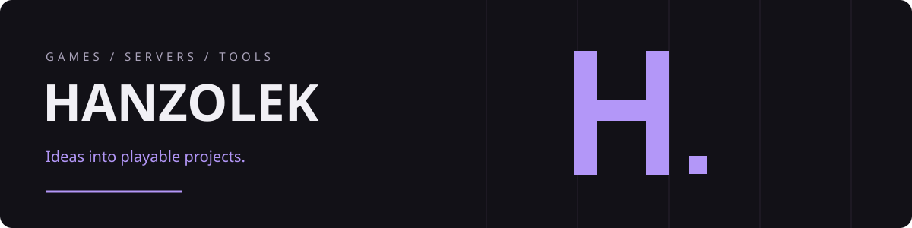

# Hi, I'm Hanzolek 👋

I develop gaming projects, Minecraft tools and server systems. My work focuses on gameplay ideas, progression, interfaces, integration and iterative testing.

## Projects

| Project | What I work on | Format |
| --- | --- | --- |
| [**Fortune Adrift**](https://github.com/Hanzikkk/Fortune-Adrift-Showcase) | A space-themed incremental game with production, automation, upgrade trees and ship repairs | Project showcase; no game downloads or source code |
| [**RavenRP**](https://github.com/Hanzikkk/RavenRP-Showcase) | A FiveM roleplay server: gameplay systems, interfaces, configuration and integration | Server and script showcase; no downloadable resources |
| [**AntiMultiAccount**](https://github.com/Hanzikkk/AntiMultiAccount) | Minecraft administration tools with GUI, MySQL storage and LuckPerms integration | Public documentation and compiled plugin releases |

## My workshop

- **Game design:** progression, resource economies, production and minigames.
- **Server systems:** configuration, permissions, data storage and resource integration.
- **Interfaces:** menus, HUDs, information layout and consistent presentation.
- **Iteration:** player feedback, practical tests and ongoing improvements.

Technologies used across my projects: **Godot / GDScript**, **FiveM / Lua / NUI**, **Java / Bukkit API**, **MySQL**.

## Po polsku

Jestem **Hanzolek**. Rozwijam projekty gamingowe — Fortune Adrift, RavenRP i narzędzia dla Minecrafta. Zajmuję się kierunkiem projektu, mechanikami, interfejsami, integracją i testowaniem kolejnych wersji.

Fortune Adrift oraz RavenRP pokazuję jako portfolio. Gra, skrypty serwera i ich kod nie są tu udostępniane.
