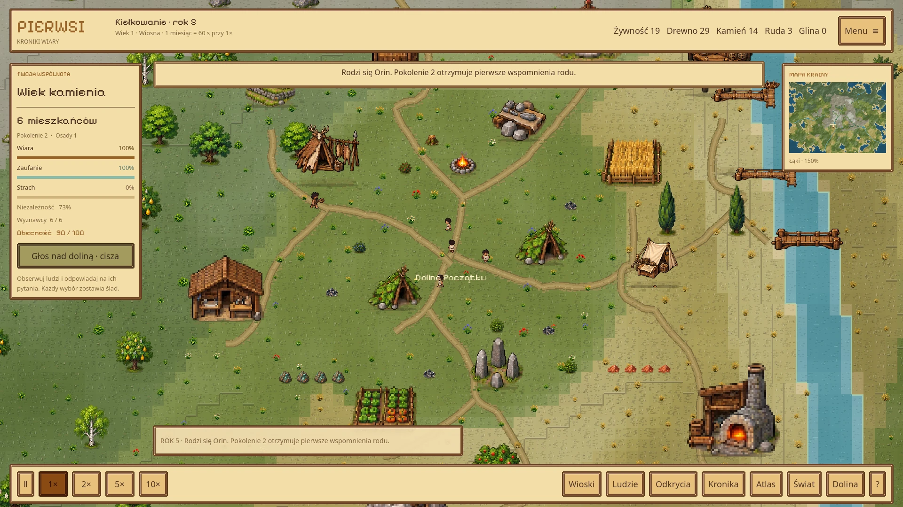

# Pierwsi

**A pixel-art god game about the beginnings of humanity, by Hanzolek.**  
**Early prototype / in development** · 2D, top-down · Godot / GDScript

Two people. An unfamiliar world. The beginnings of a civilisation. **Pierwsi** explores a world where people develop their own lives while the player influences their future through divine choices.

> Portfolio showcase only: descriptions and a development screenshot. No game downloads, playable builds or game source code are distributed here.

## The idea

Rather than directly commanding every inhabitant, you observe humanity learning, gathering resources and forming settlements. Your role as a deity centres on decisions: help people, test their faith, or intervene in ways that change their behaviour and relationships.

## Development focus

- **An autonomous society:** people, their needs, survival and settlement growth.
- **Early civilisation:** the direction moves from primitive shelters towards wooden, stone and brick buildings, alongside tools and resource use.
- **A living world:** pixel-art terrain, biomes, vegetation, animals, water and changing seasons.
- **Belief and consequences:** a decision-driven god-game concept, with faith, disagreements and the possibility of communities taking different paths.

This is an **early prototype**, with work so far focused on the world and the foundations of its simulation. The points above describe the project's direction; the full narrative and civilisation systems are still being developed.

## My role

I work on the concept, world direction, simulation rules, interfaces and iterative testing. Development uses **Godot / GDScript**, with assistance from AI tools for code and materials.

## Po polsku

**Pierwsi** to mój rozwijany prototyp gry o początkach ludzkości. Świat zaczyna się od dwojga ludzi, a kierunkiem projektu jest samodzielny rozwój społeczności: przetrwanie, odkrywanie, budowanie i kolejne pokolenia. Gracz pełni rolę boga, którego wybory mają wpływać na wiarę ludzi i dalsze losy osad.

Pixelartowy świat z kamerą z góry stanowi bazę pod dalszy rozwój symulacji. Projekt jest na **wczesnym etapie prac**. To prezentacja pomysłu i prototypu, bez udostępniania gry lub jej kodu.

[Portfolio website](https://hanzolek-portfolio.aleksyhanzewniak4.chatgpt.site/#pierwsi) · [Back to my GitHub profile](https://github.com/Hanzikkk)
