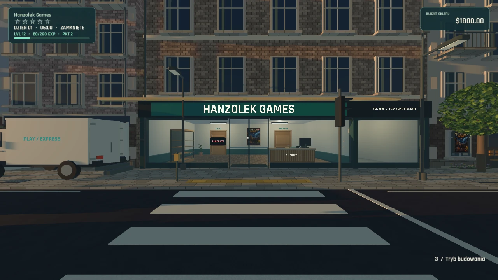
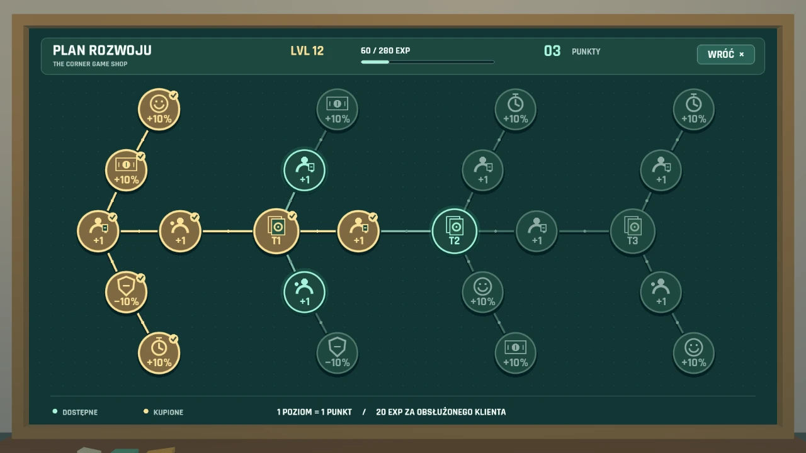

# The Corner Game Shop

**A first-person 3D game shop simulator by Hanzolek.**  
Also known during development as **GameShop** · **In development** · Godot / GDScript

Start with a small neighbourhood game shop and build a business one working day at a time. Order stock, unpack deliveries, arrange shelves, serve customers and decide where to invest next.

> Portfolio showcase only: descriptions and development screenshots. No game downloads, playable builds or game source code are distributed here.

## What I am building

- **Hands-on retail:** stocking shelves from boxes, scanning games and handling cash and card payments at the checkout.
- **Shop management:** a wholesale catalogue, purchasing, deliveries, warehouse storage and daily financial summaries.
- **A shop of your own:** movable furniture, decorations, room styles, branding and expansion.
- **Customers and staff:** shopping behaviour, feedback, cleanliness, cashiers, stockers and cleaners.
- **Progression:** experience from serving customers, shop levels and an upgrade board that unlocks game tiers and business improvements.
- **A changing neighbourhood:** a day/night cycle, weather, road traffic and delivery vehicles.

These systems are being developed and refined through playtesting. The screenshots show work in progress, not final release visuals. Multiplayer is a future direction, not a feature of the current prototype.

## Progression board

## My role

I shape the game concept, mechanics, economy, interfaces and visual direction, then test each version and turn feedback into the next set of improvements. Development uses **Godot / GDScript**, with assistance from AI tools for code and materials.

## Po polsku

**The Corner Game Shop (GameShop)** to rozwijany przeze mnie symulator prowadzenia sklepu z grami w 3D, z perspektywy pierwszej osoby. Łączy ręczną obsługę sklepu — dostawy, wykładanie towaru i pracę przy kasie — z zarządzaniem pracownikami, opiniami klientów, wystrojem oraz rozbudową lokalu. Poziomy i drzewko ulepszeń nadają kierunek rozwojowi firmy.

Projekt jest **w trakcie tworzenia i testów**. To wyłącznie prezentacja: bez plików gry, wersji do pobrania i kodu źródłowego.

[Portfolio website](https://hanzolek-portfolio.aleksyhanzewniak4.chatgpt.site/#gameshop) · [Back to my GitHub profile](https://github.com/Hanzikkk)
